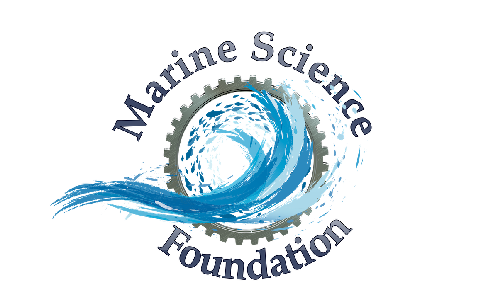

# Tech Specifications

> This repository contains the specs for Marine Science Foundation projects and associated subsystems.

# Abstract
The underlying motivation for these project is to make collecting, storing, disemmination, and verification of scientific data easy. Data can be easily manipulated when source data is private, or worse cherry-picked. We are expecting to collect and generate large amounts of scientific data. Data storage and digitial data rot is a problem we are tackling before collecting any data. [OpenData](#OpenData) refers the the overall goals regarding collection and dissemination. [SeriesData](#SeriesData) is a particular implementation for sample based data collection and immutability. We will use a simple example of a weather station data to provide an example and methodology. 

## Table of Contents

- Works In Progress
- [Specs](#specs)
  - [Open Data Concepts](#OpenData): Overarching Data Handling Guidance
    - [OpenData Repo](https://github.com/MarineScienceFoundation/SeriesData)
  - [Series Data](#SeriesData): Example implementations for sample data
    - [SeriesData Repo](https://github.com/MarineScienceFoundation/SeriesData)
  - [libp2p](https://github.com/libp2p/specs): IPFS based library, Concepts important to project 
    - [IPRS](https://github.com/libp2p/specs/blob/master/IPRS.md)
- [Contribute](#contribute)
- [License](#license)

## Works In Progress Specifications

**Specs are not finished yet. We use the following tag system to identify their state:**

-  - this spec is a work-in-progress, it is likely not even complete.
-  - this spec is a rough draft and will likely change substantially.
-  - this spec is believed to be close to final. Minor changes only.
-  - this spec is likely to improve, but not change fundamentally.
-  - this spec will not change.
## Specs
## OpenData
## SeriesData

## Contribute

Suggestions, contributions, criticisms are welcome. Though please make sure to familiarize yourself deeply with the Marine Science Foundation, the models it adopts, and the principles it follows.

Please be aware that specs are really hard to design by committee. Treat this space like you would the workshop of an artist. Please suggest improvements, but please don't be disappointed if we say no to something. What we leave out is often more important than what we add in.

## License
TBD, IPFS seems to have converged on CC-BY
